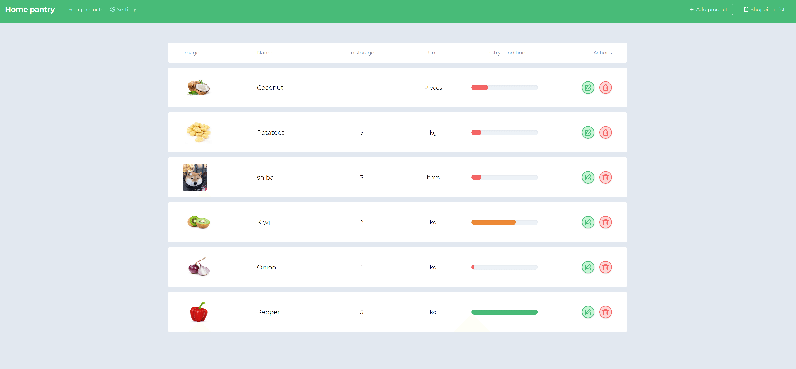

# home-pantry

https://react-home-pantry-203f8.web.app

#### Test account:

login: demo@gmail.com<br>
password: demo123



## Table of contents

- [Instructions](#Instructions)
- [Description](#Description)
- [Technologies](#Technologies)

## Instructions

First clone this repository.

```bash
$ git clone https://github.com/rawfour/home-pantry.git
```

Install dependencies. Make sure you already have [`nodejs`](https://nodejs.org/en/) & [`npm`](https://www.npmjs.com/) installed in your system.

```bash
$ npm install # or yarn
```

## Description

It is an application that allows you to record the state of food products at home, its task is to inform us in a simple and convenient way what products are already ending and which products we still have.

## Technologies

Project uses:

- React (React Hooks)
- React Router
- Redux + Redux Thunk
- Backend: Firebase
- Formik
- Tailwindcss
- Tools: ESlint, Husky + lint-staged
